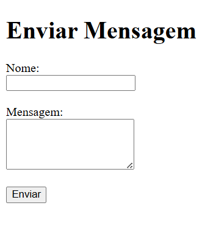
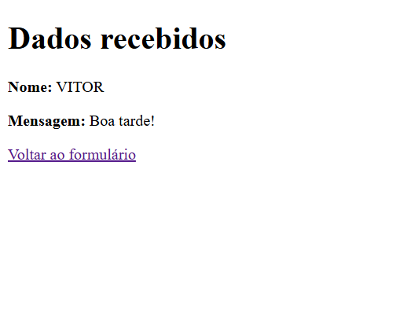

# POST Example

Exemplo simples de utilização de `$_POST` em PHP.

## 🔧 Estrutura

- `form.php` – Formulário HTML que envia nome e mensagem via POST.
- `receive.php` – Recebe os dados, faz sanitização básica e exibe.
- `image.jpg` – Print do formulário.
- `image2.jpg` – Print da tela de exibição dos dados recebidos.

## 🖼️ Capturas de Tela

### Formulário (form.php)

---

### Resposta (receive.php)

---